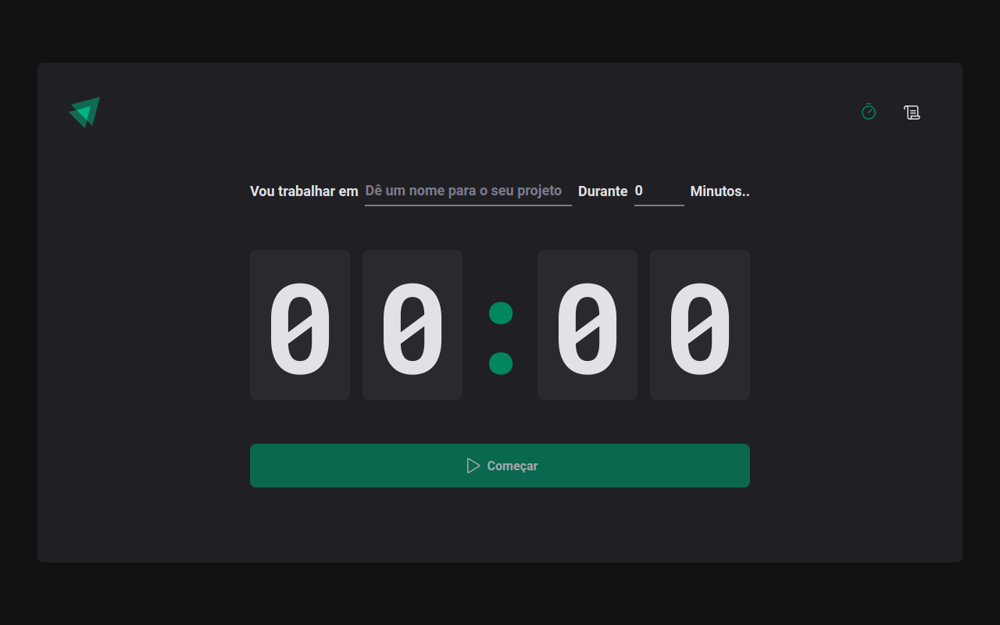

<h1 align="center"> Timer Pomodoro </h1>


<div align="center">



</div>

## 📄 Descrição da Aplicação

Essa aplicaçao foi proposta pela <a hrfe="https://www.rocketseat.com.br/" target="_blank">RocketSeat</a> No curso do **Ignite**. Ela consiste na elaboração
de um timer pomodoro onde o usuário pode digitar o nome do projeto que está trabalhando e também o **Tempo** estimado que ele vai trabalhar.
O tempo informado pelo usuário é dado em minutos onde ele pode colocar um tempo de 
**5 à 60 minutos** e o mesmo pode começar o timer e também interromper.
A aplicação tem duas página a principal é Home e a segunda é a página de Histórico do
usuário onde ele pode visualizar os tempo de trabalho que ele iniciou.

## 📓 Conhecimento adquirido elaborando essa aplicação

Nessa aplicação entrei ainda mais fundo em funcionalidades do React, e dessa vez adicionando também mais regras para praticar ainda mais o uso do ReactJS. 
Apesar de serem poucas funcionalidades, eu aprendi relembrar conceitos como:

- Estados
- ContextAPI
- LocalStorage
- Imutabilidade do estado
- Listas e chaves no ReactJS
- Propriedades
- Componentização

### Habilidades e Tecnologias 💻
 <br />
<details>
  <summary> 🖥️ Habilidades</summary>
  <br />

  - Desenvolvimento de aplicações React
  - Criatividade
  - Metodologia ágil (Scrum) (Kanban)

  <br />
</details>
 <br />
<details>
  <summary> 🖥️ Tecnologias</summary>
    <br />

  - React
    * React Hooks
  - HTML5
  - CSS3
    * Styled Components
  - JavaScript
  - TypeScripts
  - Phosphor Icons
  - ContextAPI
  - Eslint
  - Immer
  - React router Dom
  - React Hook Form
  - Date fns
  - Phosphor-react
     
</details>
<br />

### 📚 Documentação 📚
<br />
  <details>
    <summary> 🚀 Rodando o projeto</summary>
    <br />

* Faça o fork do repositório:
    Tutorial [AQUI](https://github.com/UNIVALI-LITE/Portugol-Studio/wiki/Fazendo-um-Fork-do-reposit%C3%B3rio)
* Abra seu terminal e navegue até a pasta onde preferir alocar o projeto.

* Clone o repositório:

    ```sh
      git clone git@github.com:JoaoAlberto20/Timer-Pomodoro.git
    ```

* Apos ter o repositório clonado em sua maquina, execute este comando para acessar a parta do projeto:

    ```sh
      cd Timer-Pomodoro
    ```

* Dentro da pasta do projeto, execute o comando abaixo para instalar as dependências do projeto:

    Caso utilize o npm:

    ```sh
      npm install
    ```

    Caso utilize o yarn:

    ```sh
      yarn install
    ```

* Dentro da pasta do projeto, execute o comando abaixo para iniciar o servidor do projeto:

    Caso utilize o npm:

    ```sh
      npm run dev
    ```

    Caso utilize o yarn:

    ```sh
      yarn run dev
    ```

  O aplicativo sera executado em modo de desenvolvimento.
  Abrindo na porta padrão que o React usa: <http://localhost:3000/> em seu navegador.

  </details>
<br />
